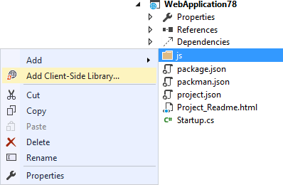
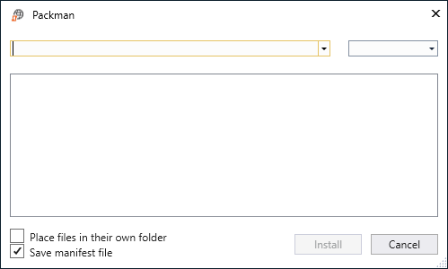
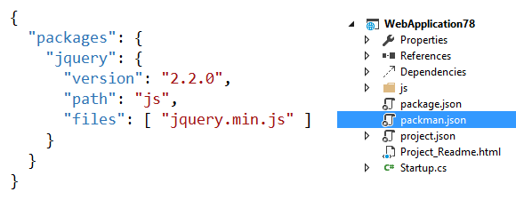
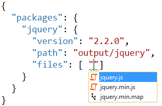
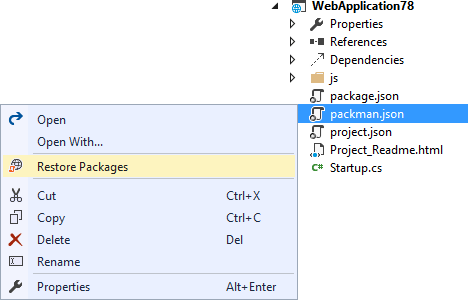
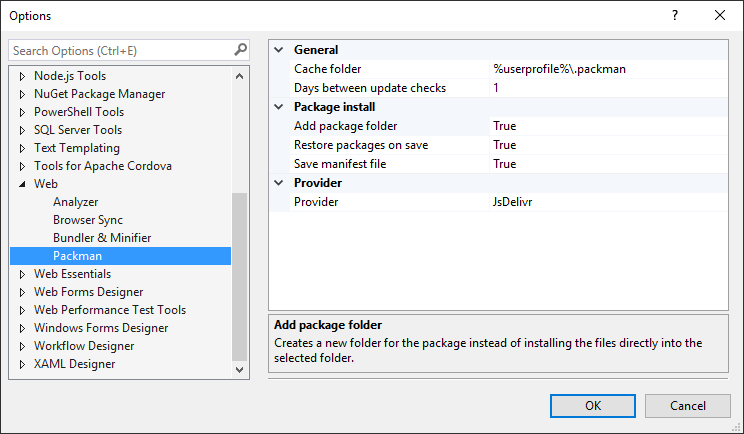

# Project Packman - a new package manager

Download the extension at the
[VS Gallery](https://visualstudiogallery.msdn.microsoft.com/4cd5e0e0-2c38-426b-9f43-1d3688cc8be1)
or get the
[nightly build](http://vsixgallery.com/extension/ce753d0f-f511-4b2b-93de-5cc50145dca6/)

See the
[changelog](CHANGELOG.md)
for changes and roadmap.

---------------------------------------------------

Packman is a package manager for client-side packages
such as JavaScript and CSS libraries. It uses well
established global content delivery networks that hosts
thousands of the most popular libraries.

Because it uses these content delivery networks as
data source, it allows the user to be in total control
over where to install the packages and what files
to install. The user is in complete control of what 
is added to the project.

This makes Packman the fastest and most flexible package
manager on the market.

## Features

- Fastest package manager in the world
- Can install packages into any folder
- Only installs the files you need and nothing else
- Great Visual Studio integration
- Is based on existing CDN infrastructure
- Can use JsDelivr and Cdnjs as pacakge catalogs

### Installing a package
Right-click any folder in your projet and hit
**Add Packman Package...**

This brings up the package installer dialog.

You can now search for the thousands of available
packages. 

When you find the right package, the
version dropdown populates to the latest stable version
of the package.

The tree view shows what files are available and will
preselect the file(s) that it thinks you may want.

### Place files in their own folder
By checking this checkbox, a folder with the same
name as the package will be created and all the package
files will be added to that folder.

This option is checked by default.

### The manifest files
A main difference between Packman and other package
managers is that a manifest file is not needed at all
in order to install packages.

NuGet uses _packages.config_, Bower uses _bower.json_ etc.

Packman uses the file name _packman.json_.

If you don't check the **Save manifest file** checkbox,
Packman will just add the package files to the selected
folder, but not keep a record of it anywhere. This is
essentially the same as going to a library's website
and manually downloading the files and copying them into
your project.

It's important to note that package restore will not be
possible without a manifest file.

The format of the manifest file is simple and easy to
understand.

If you want to modify the manifest file manually, full
Intellisense is provided for package names, versions
and file names.

You only get Intellisense for file names if the _version_
property exist and has an accurate value.

### Restoring packages
It's very easy to restore packages. Just right-click the
package.json manifest file and select
**Restore packages**.

This will hydrate your project with the files from all
the packags listed in packman.json.

## Options
An options page is available in the Visual Studio 
options dialog.

From here you can set various settings including which
provider to use - 
[JsDelivr](http://www.jsdelivr.com/)
or
[Cdnjs](https://cdnjs.com/)
.